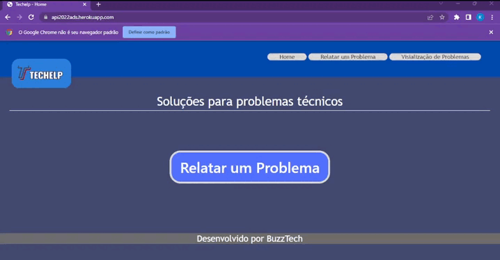
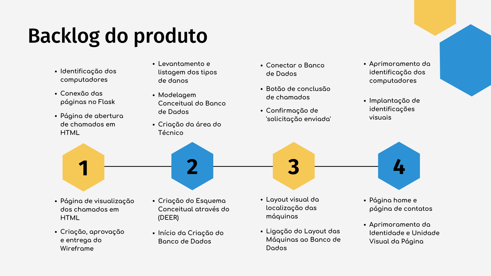

# API-ADS-SistemaOrdemServiço

      
      <h2 align="center"> Buzz Tech</h2>

 

  <a href ="#desafio"> Desafio </a>  |   
  <a href ="#escopo"> Escopo </a>  |   
  <a href ="#metodologia"> Metodologia </a>  |
  <a href ="#mvp"> MVP </a>  |
  <a href ="#sprint"> Sprints </a>  |
  <a href ="#backlog"> Backlog do Produto </a>  | 
  <a href ="#personas"> Personas </a>  |
  <a href ="#historia"> Histórias de usuário </a>  | 
  <a href ="#equipe"> Equipe </a>  |
  <a href ="#focal"> Focal Point </a>

 

<h4 align="center">
 
 
 
 
 
 
</h4>

 
 

> Status do Projeto: Em construção :construction:

 

## :medal_sports: Desafio 

Desenvolver um **Sistema Web para Controle de Ordens de Serviço (SOS)** para automatizar o processo de informação de equipamentos com mau funcionamento de  *Hardware* e *Software*. Para isto, criar um mapa de localização *(Layout)* e uma legenda com possíveis defeitos. Os desenvolvedores deverão através da  experiência adquirida sinalizar esses defeitos e sugerir ao cliente possibilidades visuais dessas indicações. Mudanças de *layout*,  nomenclatura do computador, características do *hardware* e *software*, bem como outras situações similares são funcionalidades que deverão ser contemplados no sistema. Bem como toda a documentação de desenvolvimento deverá ser lastreado no GitHub com todos os processos necessários para a fidelização do cliente.

 

## :goal_net: Escopo do Projeto 

*Pré-requisitos:*

 > *Requisitos Funcionais*

- [x] Linguagem Python (Requisito Fatec)
- [x] Linguagem HTML e CSS (Requisito Fatec)
- [x] Uso do framework Bootstarp
- [x] Apresentação via Github.
- [ ] O sistema web deverá ser intuitivo e não ter poluições de informações, isso deverá ser uma preocupação constante dos desenvolvedores sugestões de controles serão bem-vindas e bem avaliadas.

 > *Requisitos Não Funcionais*

- [x] Github

 

## :books: Metodologia 

O framework de *Metodologia Ágil* utilizado no produto foi o **Scrum**, um método ágil adaptativo, iterativo, flexível e eficaz. Este método possui os seguintes princípios norteadores:

1. *Controle empírico*
2. *Auto organização*
3. *Colaboração*
4. *Priorização da criação de valor*
5. *Time-boxing*
6. *Desenvolvimento iterativo*

Entre as ferramentas utilizadas no Scrum, uma é a divisão do projeto em **Sprints**. Para selecionar quais seriam as entregas do nossas Sprints, primeiro definimos nosso **MVP**, priorizando as tarefas que trariam maior entrega de valor para o cliente. Então, a partir das Tarefas foi construído o **Backlog do Produto**,  o qual foi aprovado pelo cliente e dividido em 4 Backlog de Sprint.

Para embasar a tomada de decisão e priorizar as tarefas com maior entrega de valor, utilizamos a construção de **Personas**. Através delas, tivemos mais clareza sobre o direcionamento das nossas **Histórias de Usuários**. Traçadas as Tarefas, Personas e Histórias de Usuários, utilizamos a ferramenta de Planning Poker para definir a quantidade de tempo necessária para cada Tarefa e dividimos da maneira mais otimizada entre os Desenvolvedores do time.

 

## 🚀 MVP 

A definição do nosso *Minimal Viable Product (MVP)* é uma versão sintética, porém funcional, de um sistema web para Controle de Ordens de Serviços. Nele o usuário poderá abrir um chamado para alertar um equipamento com mau funcionamento, no qual conterá as seguintes informações:

- Identificação do Laboratório
- Identificação do Computador
- Problema de Hardware ou Software
- Descrição do Problema

Este chamado será automaticamente gerado e organizado em uma tabela na qual o técnico terá acesso às informações fornecidas pelo usuário, bem como um número de identificação da Ordem de Serviço (OS) e dois botões:

- Um para apagar a OS;
- Outro para atualizar a OS.

A seguir um teste do MVP com a automatização dos dados sendo preenchidos, atualizados e apagados:

As instruções de como instalar e rodar a aplicação estão na [documentação detalhada da Sprint 1](doc/sprints/sprint1).

 

## :date: Sprints 

🔖 SPRINT 1 ([Link da Pasta](doc/sprints/sprint1)):  Em construção :construction:

🔖 SPRINT 2 ([Link da Pasta](doc/sprints/sprint2)):  Aguardando ::stop_sign:

🔖 SPRINT 3 ([Link da Pasta](doc/sprints/sprint3)):  Aguardando ::stop_sign:

🔖 SPRINT 4 ([Link da Pasta](doc/sprints/sprint4)):  Aguardando ::stop_sign:

 

## :seedling: Backlog do Produto

|                            Tarefa                            |                          Descrição                           |               Histórias de Usuários                | Prioridade | Sprint | Estimativa de Esforço |       Status       |
| :----------------------------------------------------------: | :----------------------------------------------------------: | :------------------------------------------------: | :--------: | :----: | :-------------------: | :----------------: |
|                Identificação dos computadores                | Levantamento de quantos computadores existem nos laboratórios da Fatec e como eles estão distribuídos por laboratório | <a href='#us01'>US01</a>, <a href='#us02'>US02</a> |   Média    |   1    |          4h           | :white_check_mark: |
|            Página de abertura de chamados em HTML            | Prototipagem e  criação da página de abertura de chamados funcional e testável para possíveis problemas em HTML. Tópicos da página: Número do laboratório;  Número do computador; Hardware ou Software. |              <a href='#us03'>US03</a>              |    Alta    |   1    |          16h          | :white_check_mark: |
|         Página de visualização dos chamados em HTML          | Prototipagem e criação da página de visualização de chamados em HTML. Tópicos da página: Chamados abertos; Data dos chamados; Botão de conclusão dos chamados |              <a href='#us04'>US04</a>              |    Alta    |   1    |          20h          | :white_check_mark: |
|                Conexão  das páginas no Flask                 | Conectar a página de abertura de chamado e de visualização de chamados utilizando o framework Flask. |              <a href='#us05'>US05</a>              |    Alta    |   1    |          10h          | :white_check_mark: |
|          Criação, aprovação e entrega do Wireframe           | Criação do protótipo das páginas de abertura de chamado e visualização de chamado com base na identidade visual do cliente. |              <a href='#us06'>US06</a>              |   Média    |   1    |          3h           | :white_check_mark: |
|          Levantamento e listagem dos tipos de danos          | Listagem dos hardware integrantes das máquinas dos laboratórios passíveis de erros e  mau funcionamento . |              <a href='#us07'>US07</a>              |   Baixa    |   2    |          3h           |   :construction:   |
|      Criação da Modelagem Conceitual do Banco de Dados       | Modelagem que descreva como os dados serão armazenados no banco e também seus  relacionamentos. Esse modelo adota alguma tecnologia, pode ser: relacional,  orientado a objetos, orientado a colunas, entre outros. |              <a href='#us08'>US08</a>              |    Alta    |   2    |          8h           |   :construction:   |
| Criação do Esquema Conceitual através do Diagrama Estrutural de Entidade Relacionamento (DEER) | Elaboração do modelo de mais alto nível, ou seja, que esta mais próximo da realidade dos  usuários. O nível conceitual é desenvolvido com alto nível de abstração, a  partir dos requisitos do sistema, extraídos na fase de levantamento de  requisitos. |              <a href='#us08'>US08</a>              |    Alta    |   2    |          1h           |    :stop_sign:     |
|             Início da Criação do Banco de Dados              | Criação do Banco de Dados funcional baseado no esquema aprovado. |              <a href='#us08'>US08</a>              |    Alta    |   2    |          13h          |    :stop_sign:     |
| Criação da área do Técnico para diferenciar a interface dependendo de quem está utilizando | Criar uma área para o técnico administrar esses chamados recebidos com a entrada em  ordem cronológica |              <a href='#us09'>US09</a>              |    Alta    |   2    |          12h          |    :stop_sign:     |
| Conectar o Banco de Dados com área do técnico e abertura de chamados | Fazer com que a área do técnico também converse com o Banco de Dados criado. |              <a href='#us10'>US10</a>              |    Alta    |   3    |          20h          |    :stop_sign:     |
|      Botão de conclusão de chamados na área do técnico       | Botão de "concluído" para que o técnico tenha controle dos chamados que  já foram resolvidos, mantendo uma área de trabalho *clean*. |              <a href='#us11'>US11</a>              |   Média    |   3    |          3h           |    :stop_sign:     |
|             Confirmação de 'solicitação enviada'             | Sinalizar ao usuário solicitante da abertura do chamado quando esse chamado tiver sido  recebido pelo sistema. |              <a href='#us12'>US12</a>              |    Alta    |   3    |          7h           |    :stop_sign:     |
|          Layout visual da localização das máquinas           | Implementação  do layout levantado das máquinas dos laboratórios. | <a href='#us13'>US13</a>, <a href='#us14'>US14</a> |    Alta    |   3    |          20h          |    :stop_sign:     |
| Ligação do Layout da localização das Máquinas do laboratório ao Banco de Dados | Fazer  com que o layout da disposição das máquinas esteja integrado ao banco de  dados. |              <a href='#us15'>US15</a>              |    Alta    |   3    |          13h          |    :stop_sign:     |
|       Aprimoramento da identificação dos computadores        | Abertura  de um canal para possibilizar que detalhes do computador sejam alterados e armazenados. Por exemplo, alterar as especificações  dos computadores. |              <a href='#us16'>US16</a>              |    Alta    |   4    |          10h          |    :stop_sign:     |
|              Criação de identificações visuais               | Criar  possibilidades visuais dessas indicações e sinalizar esses defeitos e sugerir ao cliente. |              <a href='#us17'>US17</a>              |    Alta    |   4    |          10h          |    :stop_sign:     |
|       Criação de uma página home e página de contatos        | Criar  página de detalhamento da funcionalidade do sistema e uma página de contato |              <a href='#us18'>US18</a>              |   Baixa    |   4    |          5h           |    :stop_sign:     |
|    Aprimoramento da Identidade e Unidade Visual da Página    | Fazer a  atualização visual de todo o sistema aproximando-o do wireframe  apresentado |              <a href='#us19'>US19</a>              |   Baixa    |   4    |          20h          |    :stop_sign:     |

 

## :round_pushpin: Roadmap

 

## :moyai: Personas 

| Natália, 19 anos, estudante da Fatec de São José dos Campos  |
| :----------------------------------------------------------: |
| Natália estuda no período da manhã e, ocasionalmente, usa a  biblioteca e o laboratório da Fatec durante a tarde para estudar e fazer os  trabalhos. Como está em seu primeiro semestre e não tem muita experiência com  computadores, às vezes ela enfrenta alguns problemas para usar as máquinas e  geralmente não sabe o que fazer. Natália gostaria de ter uma forma simples,  prática e rápida de avisar o corpo técnico da Fatec quando não consegue usar  o computador como quer, seja por algum problema de hardware ou de  software. |

| Pedro,  35 anos, técnico de suporte da Fatec São José dos Campos |
| :----------------------------------------------------------: |
| Pedro trabalha na Fatec há 2 anos e na área de técnico de  computadores há mais de 5 anos. Ele tem considerável experiência na área de manutenção, mas pouco conhecimento na parte administrativa. Como Pedro fica  parte do expediente sozinho, ele precisa de um sistema que gere e organize as  ordens de serviço de manutenção de uma maneira simples e intuitiva, para que  ele possa organizar melhor os afazeres do seu dia-a-dia. |

| Andréia,  59 anos, professora de logística da Fatec São José dos Campos |
| :----------------------------------------------------------: |
| Andréia é professora do curso de logística há quase uma década.  Apesar de ter vasta experiência na disciplina que leciona, Direito Comercial,  às vezes Andréia encontra algumas dificuldades para usar os  computadores e programas disponíveis na Fatec. Como é de outra geração e começou a ter acesso aos PCs muito mais tarde na vida, ela ocasionalmente precisa de ajuda técnica durante as aulas. Por isso, seria muito cômodo que ela  conseguisse abrir um chamado para o pessoal responsável e eles conseguissem saber se essa ajuda é urgente, se ela está dando aula e precisa de algo agora, por  exemplo, ou se é um problema que eles têm um prazo maior para resolver. |

 

## :key: Histórias de Usuário

|          ID           |                     História de Usuário                      |
| :-------------------: | :----------------------------------------------------------: |
| US01 | Natália, aluna e Andréa, professora, precisam de uma forma de identificação nominal dos computadores. |
| US02 | Pedro, técnico, precisa de uma identificação para diferenciar os diversos computadores semelhantes dentro da Fatec. |
| US03 | Como  estudante e professora, Natália e Andreia, respectivamente, deveriam ser  capazes de pedir ajuda ao técnico quando o computador não estivesse  funcionando como esperado. |
| US04 | Como  técnico responsável pelo bom funcionamento dos computadores, Pedro deveria  ter um acesso rápido aos relatos dos problemas técnicos dos computadores. |
| US05 | Pedro  precisa de um ambiente com sistema integrado para que ele receber automaticamente os chamados abertos pelos usuários. |
| US06 | Como usuárias, Natália e Andréa precisam de uma interface *clean* e intuitiva que seja fácil de usar e, ao mesmo tempo, não falte as informações as necessária para que Pedro identifique o problema. |
| US07 | Como  profissional de outra geração, Andréia pode ter dificuldades para relatar o  problema em sua máquina, ela quer uma lista dos principais possíveis  problemas para facilitar seu relato na solicitação. |
| US08 | Pedro precisa de um ambiente com sistema integrado para que seja melhor gerenciável e confiável  à administração das tarefas . |
| US09 | Pedro necessita de uma área de acesso único para que ele visualize os pedidos de assistência e entenda sua propriedade, sem outros usuários vejam ou interferirem no  fechamento dos chamados. |
| US10 | Pedro precisa de um sistema integrado que faça a interação direta entre os chamados abertos e a  área do técnico para um fundamental bom gerenciamento do tempo e tarefas. |
| US11 | Para que o técnico Pedro tenha um controle visual melhor das chamadas ainda não atendidas, o botã de conclusão de chamadas fará com que um chamado 'concluído' saia da área de visualização pendente |
| US12 | Para Natália e Andréia um aviso de "confirmação de envio" da solicitação na própria página de abertura de chamados é necessário para que tenha conhecimento do envio, assim evitando que seja enviado repetidas vezes o mesmo problema, melhorando a interface com o usuário e impedindo que Pedro tenha muitos recebimentos com as mesmas solicitações |
| US13 | Natália, aluna e Andréa, professora, precisam de uma forma de identificação visual do computador dentro do laboratório disposto para confirmar que estão falando do computador correto quando abrirem o chamado. |
| US14 | Pedro, técnico, precisa de uma identificação visual para saber exatamente qual computador está com problemas e onde está esse computador, pois isso evitará confusões e perda de tempo. |
| US15 | Para que Natália, aluna, e Andréa, professora, possam especificar para qual computador estão abrindo o chamado, é necessário que o layout das máquinas esteja ligado ao banco de dados, evitando possíveis erros de digitação e interpretação. |
|         US16          | Pedro precisa de um ambiente para que ele consiga acessar os detalhes da máquina e  que possa visualizar o histórico dela, saber se algum problema está sendo  recorrente, facilitando assim a manutenção. |
| US17 | Por ser mais velha, Andréia pode ter dificuldade de entender o que está escrito ou mesmo ao que se refere cada parte da solicitação de informações. Por isso, deverá ser criada identificações visuais, facilitando a comunicação e entendimento do usuário. |
| US18 | Natália pode sentir a necessidade de saber quais serviços ela pode solicitar na  página. Logo, eles estarão descritos melhor na página home. Andréia pode não conseguir expressar seu problema por escrito ou não ter seu problema resolvido, logo, uma página de contato poderá ser útil para que ela  tenha notícias sobre a sua solicitação. |
| US19 | Pedro, Andréia e Natália precisam de uma  identidade visual que transmita confiança, autoridade e conforto. |

 

## :mortar_board: Equipe 

|      Membro      |    Função     |                            Github                            |                           Linkedin                           |
| :--------------: | :-----------: | :----------------------------------------------------------: | :----------------------------------------------------------: |
|    Vitor Lima    | Scrum Master  |  |  |
|   Alícea Rocha   | Product Owner |  |  |
|  Cláudia Secco   | Desenvolvedor |  |                                                              |
| Danilo Rodrigues | Desenvolvedor |  |  |
| Giuliano Bianco  | Desenvolvedor |  |  |
| Isaque da Silva  | Desenvolvedor |  |  |
| Joice de Araújo  | Desenvolvedor |  |  |
| Maurício Joaquim | Desenvolvedor |  |  |

 

## :dart: Focal Point

| PO²              | M²       |
| :-------------------: | :-----------: |
| <a href='http://lattes.cnpq.br/0858832006050432'>Prof. Antonio Egydio São Thiago Graça</a> | <a href='http://lattes.cnpq.br/4723982029081265'>Prof.  Jean Carlos Lourenço Costa</a> |
