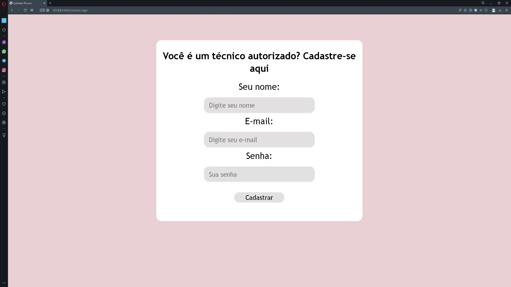
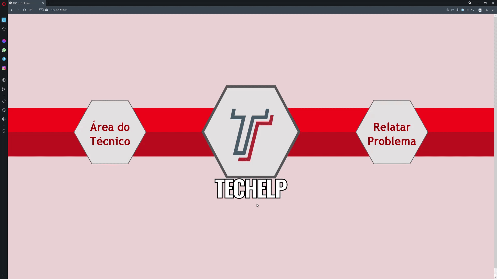
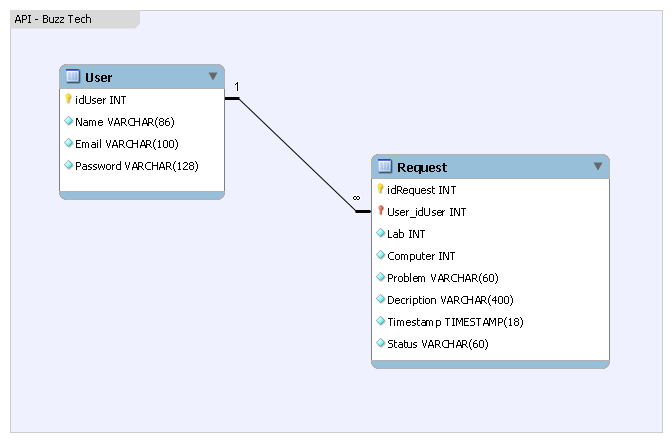
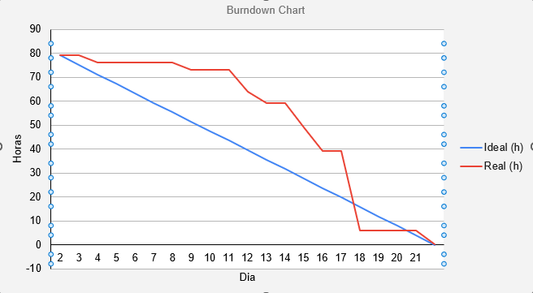

# Sprint 2 - Banco de Dados & Layout

      
      <h2 align="center"> Buzz Tech</h2>

 

  <a href ="#backlog"> Backlog da Sprint </a>  | 
  <a href ="#tarefas"> Tarefas </a>  | 
  <a href ="#burndown"> Burndown </a>  |
  <a href ="#evolução"> Evolução do Backlog </a>  |
  <a href ="#hitoria"> Histórias de Usuários </a>

 

<h4 align="center">
 
 
 
 
 
 
 
</h4>

 

> Status da Sprint: Concluída :heavy_check_mark:

 

Na segunda sprint buscou-se aprimorar o produto através da criação e consolidação de um banco de dados relacional utilizando-se MySQL e Flask-SQLAlchemy. Para atingir um maior valor do produto, foram adicionadas diversas funcionalidades no produto na perspectiva da utilização do técnico. A versão sintética e funcional do um sistema foi acrescida primeiro da modelagem de um banco de dados relacional com duas entidades, relacionando as Ordens de Serviço aos  Usuários cadastrados, ou seja, os técnicos que atenderão cada ordem. Através dessa atualização, o técnico será cadastrados com usuário e senha e terá uma visão diferenciada dos chamados, podendo atualizar e deletar os registros de ordens de serviço criados no banco de dados.

Outra mudança que vale destacar é a implementação e atualização de soluções visuais que visam facilitar a utilização do sistema pelos usuários que desejarem abrir uma ordem de serviço de reclamação de problemas. O wireframe foi pensando para criar um uso mais fluido e intuitivo para os usuários. Para isso, foram utilizados  ícones, paletas de cores, bem como botões para preenchimento de algumas informações, ao invés dos formulários por escrito.

Para visualizar o *Wireframe* em PDF, acesse o [link :link:](img/wireframe.pdf).

### :bust_in_silhouette: Cadastro do técnico

### :telephone_receiver: Abertura de chamado

### 	:eyes: Visualização do chamado

 

##  :date: Backlog da Sprint

|                            Tarefa                            |                          Descrição                           |  Histórias de Usuários   | Prioridade | Sprint | Estimativa de Esforço |       Status       |
| :----------------------------------------------------------: | :----------------------------------------------------------: | :----------------------: | :--------: | :----: | :-------------------: | :----------------: |
| <a href='#levantamento'>Levantamento dos tipos de danos</a>  | Listagem dos hardware integrantes das máquinas dos laboratórios passíveis de erros e má funcionamento. | <a href='#us07'>US07</a> |   Baixa    |   2    |          3h           | :white_check_mark: |
| <a href='#insercao'>Inserção dos principais tipos de danos de hardware no sistema</a> | Inserção dos principais tipos de danos no sistema contendo os problemas de hardware com maior probabilidade de ocorrência. | <a href='#us07'>US07</a> |    Alta    |   2    |          9h           | :white_check_mark: |
| <a href='#modelagem'>Criação da Modelagem Conceitual do Banco de Dados</a> | Criação da Modelagem Conceitual através da descrição de como os dados serão armazenados no banco e também seus relacionamentos. | <a href='#us08'>US08</a> |    Alta    |   2    |          8h           | :white_check_mark: |
| <a href='#deer'>Criação do Esquema Conceitual através do Diagrama Estrutural de Entidade Relacional (DEER)</a> | Criação de um modelo de mais alto nível, ou seja, que esta mais próximo da realidade dos usuários. Esse modelo pode é elaborado por meio Diagrama Estrutural de Entidade e Relacionamento (DEER). | <a href='#us08'>US08</a> |    Alta    |   2    |          1h           | :white_check_mark: |
|       <a href='#sql'>Criação do Banco de Dados SQL</a>       | Criação do Banco de Dados relacional e funcional baseado na modelagem e no esquema aprovados. | <a href='#us20'>US20</a> |    Alta    |   2    |          13h          | :white_check_mark: |
| <a href='#funcoes'>Funções de ligação da aplicação com o banco de dados</a> | Criação de funções em Python que levem os dados preenchidos pelos usuários nos campos de abertura de chamado até o banco de dados, e assim salvem esses dados de uma maneira persistida. | <a href='#us21'>US21</a> |    Alta    |   2    |          12h          | :white_check_mark: |
|      <a href='#tecnico'>Criação da área do Técnico</a>       | Criar uma área para o técnico administrar esses chamados recebidos com a entrada em ordem cronológica. | <a href='#us09'>US09</a> |    Alta    |   2    |          12h          | :white_check_mark: |
| <a href='#login'>Login simplificado para o técnico e diferenciação da interface dependendo de  quem está utilizando</a> | Possibilidade de criar usuários para o sistema de ordem de serviço para que os técnicos tenham uma maneira segura e privada de visualizar, deletar, procurar, filtrar e atualizar os chamados criados pelos usuários. | <a href='#us09'>US09</a> |    Alta    |   2    |          9h           | :white_check_mark: |
|   <a href='#visuais'>Implementar facilitações visuais</a>    | Utilização de cores, ícones e outras soluções gráficas que facilitem o entendimento das informações dos sistemas para os usuários que desejem utilizá-lo. | <a href='#us17'>US17</a> |   Baixa    |   2    |          3h           | :white_check_mark: |

 

## :checkered_flag: Tarefas

1. ### Levantamento dos principais tipos de danos de hardware

   A partir de pesquisa com funcionários responsáveis pela manutenção dos computadores e visita aos laboratórios, foi feita uma listagem dos hardware integrantes das máquinas dos laboratórios passíveis de erros e má funcionamento. Essa tarefa teve como saída a lista de problemas de hardware que deu insumo para a tarefa seguinte, de inserção dos principais problemas no sistema.

   

2. ### Inserção dos principais tipos de danos de hardware no sistema

   Para esta etapa, foram utilizadas as informações coletadas na tarefa de levantamento dos tipos de dano para, então, inseri-los no sistema. Criou-se uma listagem de botões com opções previamente preenchidas contendo os problemas de hardware com maior probabilidade de ocorrência. Assim, os usuários têm maior facilidade ao cadastrar um desses problemas mais recorrentes. A listagem de botões contendo os danos de hardware mais comuns ficou como mostra a imagem a seguir:

 

3. ### Criação da Modelagem Conceitual do Banco de Dados

   Através da descrição de como os dados serão armazenados no banco e também seus relacionamentos, bem como com diversas discussões com o cliente sobre as suas necessidades, foi feita a criação da modelagem conceitual do banco de dados relacional. Chegou-se à conclusão que, para essa atual etapa do projeto, eram necessárias apenas duas tabelas: uma para os chamados, outra para os usuários. Essa tabelas teriam cardinalidade de 1 para N, com a chave primária da tabela de usuários sendo usada como a chave estrangeira na tabela de chamados. A partir desse conceito foi esboçado o Diagrama Estrutural de Entidade Relacional que pode ser visto na próxima tarefa.

   

4. ### Criação do Diagrama Estrutural de Entidade Relacional (DEER)

   Com as informações levantadas na tarefa anterior, começou-se a criação de um modelo de mais alto nível, ou seja, que esta mais próximo da realidade dos usuários. Esse modelo pode é elaborado por meio Diagrama Estrutural de Entidade e Relacionamento (DEER) e tem como objetivo estruturar de maneira visual como ficará o Esquema do Banco de Dados quando este estiver implementado na linguagem escolhida, no nosso caso, o MySQL. A seguir, como ficou o DEER após criado na ferramenta Workbench do MySQL:

   

   

   

5. ### Criação do Banco de Dados SQL

   Após a modelagem conceitual e a criação do DEER, o passo seguinte foi a criação do Banco de Dados relacional e funcional baseado na modelagem e no esquema aprovados. Para tanto, foi utilizado a linguagem MySQL para seguir o planejamento das tabelas de usuários e chamados. Vale ressaltar que etapa foi imensamente facilitada e ganhou em eficiência por contar com as informações bem fundamentadas das duas tarefas anteriores.

   

6. ### Funções de ligação da aplicação com o banco de dados

   Nesta tarefa foram criadas as funções em linguagem Python para conectar o frontend ao banco de dados. Através dessas funçõesos, os dados preenchidos pelos usuários nos campos de abertura de chamado são traduzidos para comandos que persistem essas informações na tabela de chamados do banco de dados. O mesmo foi feito para a criação de login e para a área do técnico, onde ao alterar os dados interface gráfica do sistema, o mesmo é alterado no banco de dados.

   

7. ### Criação da área do Técnico

   Com as funções para conectar a interface gráfica com o banco de dados, foi possível criar uma área para o técnico na qual ele possa administrar os chamados recebidos, visualizando eles em ordem cronológica, bem como interagindo com esses dados. Dois botões permitem que o técnico ou edite as informações de um chamado, ou exclua o registro se assim desejar. A seguir, uma imagem de como ficou essa área após implementada:

8. ### Login para o técnico e diferenciação da interface 

   Com a criação de uma tabela de usuários no nosso banco de dados, ficou possível criar usuários para o sistema de ordem de serviço para que os técnicos tenham uma maneira segura e privada de visualizar, deletar, procurar, filtrar e atualizar os chamados criados pelos usuários. Logo, uma das tarefas foi criar uma tela simplificada para criação dos usuários, bem como para o login. Para este, foi criado um modal que, a partir de qualquer página do sistema, é possível realizar o login. A seguir, como ficaram essas duas telas:

9. ### Implementar facilitações visuais 

   Como requisito do produto, é necessário a utilização de cores, ícones e outras soluções gráficas que facilitem o entendimento das informações dos sistemas para os usuários que desejem utilizá-lo. Neste sentido, nós criamos ícones que tornam a utilização mais intuitiva tanto para o técnico, quanto para quem for abrir um chamado no sistema. Na parte do técnico, utilizamos divisórias nas tabelas que facilitam a leitura dos registros, bem como dois ícones com cores e ícones intuitivos, sendo o verde com um uma seta circular para editar, e o vermelho com uma lixeira para apagar o registro. 

   

   

   

   Já nas páginas de abertura de chamado, foram feitas implementações gráficas desde o começo do processo. Com a escolha dos laboratórios e computadores através de ícones em formatos de portas, até a escolha dos computadores com ícones em formato de monitores.

   

   

   

   

 

## :fire: Burndown

 

## :hatching_chick: Evolução do Backolog

Como a metodologia ágil Scrum tem como princípios a adaptabilidade e o processo iteraitvo, mudanças ocorrem para que o produto chegue ao final da Sprint com o maior valor possível. Para isto, foram necessárias alterações de tarefas que geraram 4 atualizações de versão do Backlog do Produto:

|              **Backlog 3.0**  10% █▒▒▒▒▒▒▒▒▒              |
| :----------------------------------------------------------: |
|          Levantamento e listagem dos tipos de danos          |
|      Criação da Modelagem Conceitual do Banco de Dados       |
| Criação do Esquema Conceitual através do Diagrama Estrutural de Entidade Relacionamento (DEER) |
|             Início da Criação do Banco de Dados              |
| Criação da área do Técnico para diferenciar a interface dependendo de quem está utilizando |

|               Backlog 3.22 99% ██████████]                |
| :----------------------------------------------------------: |
|          Levantamento e listagem dos tipos de danos          |
| Inserção dos principais tipos de danos no sistema em lista hardware, software, rede |
|      Criação da Modelagem Conceitual do Banco de Dados       |
| Criação do Esquema Conceitual através do Diagrama Estrutural de Entidade Relacional (DEER) |
|                Criação do Banco de Dados SQL                 |
|     Funções de ligação da aplicação com o banco de dados     |
|                  Criação da área do Técnico                  |
| Login simplista para o técnico com diferenciação da interface dependendo de  quem está utilizando |
| Implementar algumas facilitações visuais (hard, software, rede, mouse, monitor etc) |

 

## :key: Histórias de Usuário

|          ID           |                     História de Usuário                      |
| :-------------------: | :----------------------------------------------------------: |
| US07 | Como profissional de outra geração, Andréia pode ter dificuldades para relatar o problema em sua máquina, ela quer uma lista dos principais possíveis problemas para facilitar seu relato na solicitação. |
| US08 | Pedro precisa de um ambiente com sistema integrado para que seja melhor e confiável a administração das tarefas |
| US09 | Pedro necessita de uma área de acesso único para que ele visualize os pedidos de assistência e entenda sua propriedade, sem outros usuários vejam ou interferirem no fechamento dos chamados. |
| US17 | Por ser mais velha, Andréia pode ter dificuldade de entender o que está escrito ou mesmo ao que se refere cada parte da solicitação de informações. Por isso, deverá ser criada identificações visuais, facilitando a comunicação e entendimento do usuário. |
| US20 | Pedro precisa de um ambiente o qual os dados das ordens de serviço fiquem armazenados mesmo depois que sua sessão acabar. |
| US21 | Pedro precisa de uma maneira de conectar o sistema web ao o banco de dados e, a partir dessa conexão, poder inserir, deletar, procurar, filtrar e atualizar os dados registrados nesse banco de dados. |
